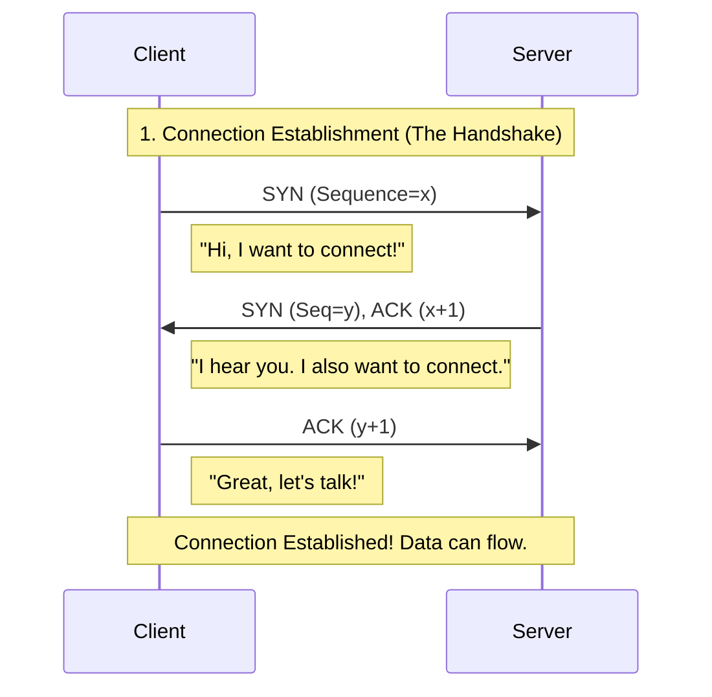
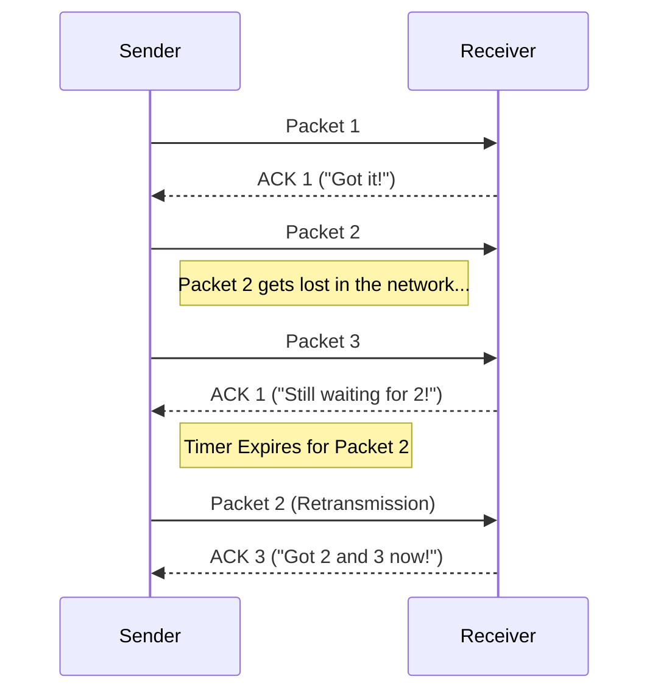

# Lesson 2: Networking Basics - The Plumbing of the Internet (Deep Dive)

To build scalable systems, you need to understand how data moves from Server A to Server B. It's not magic; it's protocols.

## 1. The OSI Model (The 7 Layers)
Think of this as a package delivery system. You (Layer 7) write a letter, and by the time it leaves your house (Layer 1), it's wrapped in multiple envelopes.

| Layer | Name | What it does | Real World Analogy | Protocols |
| :--- | :--- | :--- | :--- | :--- |
| **7** | **Application** | **What the user sees.** HTTP requests, JSON data. | The Letter content itself. | HTTP, SMTP, SSH |
| **6** | Presentation | Encryption (SSL/TLS), Compression (Gzip). | Translating to English, Sealing the envelope. | SSL/TLS |
| **5** | Session | Managing the connection (Logins, Sessions). | "Dear John..." / "Sincerely..." | Sockets |
| **4** | **Transport** | **Reliability & Port Numbers.** TCP vs UDP. | The Delivery Truck (FedEx vs Regular Mail). | TCP, UDP |
| **3** | **Network** | **Routing (IP Addresses).** Finding the path. | The GPS / Address on the envelope. | IP, ICMP |
| **2** | Data Link | MAC Addresses (Physical hardware ID). | The local mailman knowing your house. | Ethernet, Wi-Fi |
| **1** | Physical | 0s and 1s over wire/radio. | The road, the truck's tires. | Fiber, Copper |

> **Senior Engineer Note**: In System Design, we mostly care about **Layer 7 (HTTP/Load Balancers)** and **Layer 4 (TCP/UDP/Ports)**.

---

## 2. TCP vs UDP: The Ultimate Comparison

This is the most critical decision you make when designing real-time apps.

| Feature | 🐢 TCP (Transmission Control Protocol) | 🐇 UDP (User Datagram Protocol) |
| :--- | :--- | :--- |
| **Connection** | **Connection-Oriented**. Must shake hands first. | **Connectionless**. Just start shouting. |
| **Reliability** | **Guaranteed**. If a packet is lost, it resends it. | **Unreliable**. If it's lost, it's gone. |
| **Ordering** | **Ordered**. Packet 1 always arrives before Packet 2. | **Unordered**. Packet 2 might arrive first. |
| **Speed** | **Slower**. Overhead from handshakes, ACKs, and error checking. | **Faster**. No overhead. Just raw speed. |
| **Flow Control** | **Yes**. "Slow down, I'm overwhelmed!" | **No**. "I'm sending at full speed, good luck!" |
| **Header Size** | **Heavy** (20-60 bytes). | **Light** (8 bytes). |
| **Use Cases** | Web (HTTP), Email, File Transfer, Banking. | Video Streaming, Gaming, VoIP, DNS. |

---

## 3. The TCP 3-Way Handshake (Visualized)

Before TCP sends any data, it establishes a connection. This adds **latency**.

> **Why this matters**: Every new HTTP connection has this overhead. This is why we use **Keep-Alive** (reusing connections) to make websites faster.

---

## 4. How TCP Guarantees Reliability (The "Ack" Flow)

TCP doesn't just send data; it ensures it arrived.

---

## 5. Flow Control & Congestion Control (Senior Concepts)

### 🌊 Flow Control (Don't drown the receiver)
Imagine you are pouring water (data) into a glass (receiver's buffer). If you pour too fast, it spills.
*   **Mechanism**: The receiver tells the sender its **Window Size** ("I have 5kb of free space").
*   The sender will **stop** sending if the window is full.

### 🚦 Congestion Control (Don't clog the network)
Imagine a highway. If everyone drives at 100mph, you get a traffic jam.
*   **Mechanism**: TCP starts slow (**Slow Start**). It sends 1 packet, then 2, then 4... exponentially increasing speed until it detects packet loss.
*   **Packet Loss** = "Traffic Jam". TCP immediately slows down to let the network recover.

---

## 6. Practical Exercise
We will write two Python scripts:
1.  **TCP Server/Client**: We will see that data *always* arrives.
2.  **UDP Server/Client**: We will see that we don't need to "connect" to send data.
