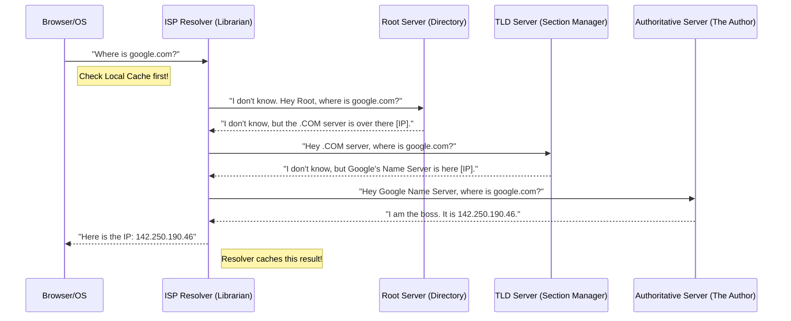

# Lesson 3: Application Layer Protocols - How the Web Speaks

Now that we know how data moves (TCP/UDP), let's look at the languages used by applications to talk to each other.

## 1. DNS (Domain Name System) - The Phonebook of the Internet
Computers don't know "google.com"; they only know IP addresses (e.g., `142.250.190.46`). DNS translates human-readable names to IPs.

### 1.1 The Cast of Characters (Definitions)
Before looking at the flow, let's understand who is talking to whom. Imagine you are looking for a book in a massive library.

1.  **User (Browser/OS)**: This is **You**. You just want the book (the IP address). You don't care how it's found.
2.  **Resolver (ISP Resolver)**: This is the **Librarian**. You ask them, and they do all the running around to find it for you. They are usually provided by your Internet Service Provider (ISP) or Google (8.8.8.8).
3.  **Root Server (.)**: This is the **Directory of Sections**. It doesn't know where "google.com" is, but it knows where the ".com" section is.
4.  **TLD Server (Top-Level Domain)**: This is the **Section Manager**. It manages everything ending in `.com`. It doesn't know the IP, but it knows which specific name server handles "google".
5.  **Authoritative Server**: This is the **Author**. It is the final source of truth. It knows the exact IP address of "google.com".

### 1.2 The Lookup Flow (The Conversation)
When you type `google.com` and hit enter, this conversation happens in milliseconds:

---

## 2. HTTP & HTTPS (HyperText Transfer Protocol)
This is the foundation of data communication for the World Wide Web.

### The Request/Response Cycle
1.  **Client** sends a **Request**:
    *   **Method**: `GET` (Read), `POST` (Create), `PUT` (Update), `DELETE` (Remove).
    *   **URL**: `/users/123`
    *   **Headers**: `Content-Type: application/json`
2.  **Server** sends a **Response**:
    *   **Status Code**:
        *   `2xx` (Success): 200 OK, 201 Created.
        *   `3xx` (Redirect): 301 Moved Permanently.
        *   `4xx` (Client Error): 400 Bad Request, 401 Unauthorized, 404 Not Found.
        *   **`5xx` (Server Error)**: 500 Internal Server Error, 502 Bad Gateway.

### HTTPS (Secure)
HTTPS is HTTP encrypted using **TLS (Transport Layer Security)**.
*   **Handshake**: Before sending data, the client and server agree on a "secret key" using public/private key cryptography.
*   **Result**: Even if someone intercepts the Wi-Fi packets, they only see garbage data, not your password.

---

## 3. WebSockets (Real-Time Communication)
HTTP is **unidirectional**: Client asks, Server answers. Server *cannot* speak unless spoken to.
**WebSockets** allow **bidirectional** (full-duplex) communication.

### The Upgrade Handshake
1.  Client sends standard HTTP Request: `Connection: Upgrade`, `Upgrade: websocket`.
2.  Server responds: `101 Switching Protocols`.
3.  **Connection stays open!** Both sides can send messages anytime.

**Use Cases**: Chat Apps (WhatsApp), Live Sports Scores, Stock Tickers, Multiplayer Games.

---

## 4. API Paradigms: REST vs GraphQL vs gRPC
How should your microservices talk to each other?

| Feature | 🌐 REST (Representational State Transfer) | 🕸️ GraphQL | ⚡ gRPC (Google Remote Procedure Call) |
| :--- | :--- | :--- | :--- |
| **Protocol** | HTTP/1.1 (Text-based) | HTTP/1.1 (Text-based) | **HTTP/2** (Binary-based) |
| **Data Format** | JSON (usually) | JSON | **Protobuf** (Binary, very small) |
| **Philosophy** | **Resource-based**. `/users/1` returns the user. | **Query-based**. Ask for exactly what you need. | **Action-based**. Call functions like `GetUser()`. |
| **Over-fetching** | **Yes**. You get the whole user object even if you just want the name. | **No**. You specify `user { name }`. | **No**. Highly optimized. |
| **Browser Support**| **Excellent**. Native support. | **Excellent**. | **Poor**. Needs a proxy (gRPC-Web). |
| **Use Case** | Public APIs (Stripe, Twitter). Simple apps. | Complex Frontends (Facebook, Shopify). | **Internal Microservices**. High performance. |

### Summary Table
*   **Building a Public API?** Go with **REST**.
*   **Building a Complex Dashboard?** Go with **GraphQL**.
*   **Connecting Microservices?** Go with **gRPC**.

---

## 5. Practical Exercise
We will write a Python script to:
1.  Perform a manual **DNS Lookup**.
2.  Make a raw **HTTP Request** (without a browser).
