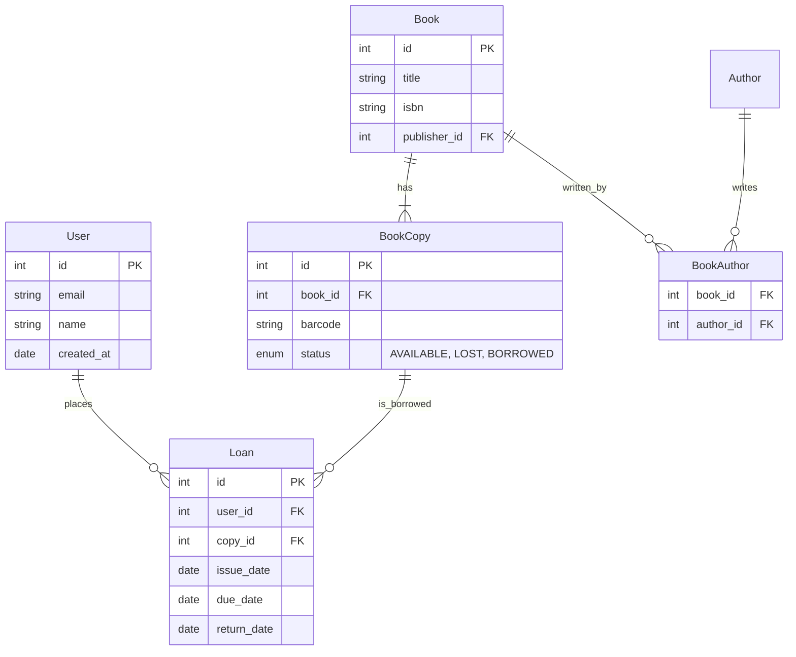

# Case Study: Library Management System 📚

## The requirements
1.  **Users** can sign up and borrow books.
2.  **Books** have Authors and Categories (Genres).
3.  A Book can have multiple **Copies** (Barcode 1, Barcode 2).
4.  We need to track **Loans** (who borrowed what, when is it due).

## 1. The ER Diagram (Mermaid)



## 2. The SQL Implementation (Postgres Style)

```sql
-- 1. Users Table
CREATE TABLE users (
    id SERIAL PRIMARY KEY,
    name VARCHAR(100) NOT NULL,
    email VARCHAR(100) UNIQUE NOT NULL,
    joined_at TIMESTAMP DEFAULT NOW()
);

-- 2. Books Table (The Metadata)
CREATE TABLE books (
    id SERIAL PRIMARY KEY,
    title VARCHAR(255) NOT NULL,
    isbn VARCHAR(13) UNIQUE NOT NULL,
    publication_year INT
);

-- 3. Book Copies (The Physical Items)
-- Why separate? Because we have 5 copies of "Harry Potter".
CREATE TABLE book_copies (
    id SERIAL PRIMARY KEY,
    book_id INT REFERENCES books(id),
    barcode VARCHAR(50) UNIQUE NOT NULL,
    status VARCHAR(20) DEFAULT 'AVAILABLE' -- Enum: AVAILABLE, BORROWED, LOST
);

-- 4. Loans (The Transaction Table)
-- Tracks the lifecycle of a borrow.
CREATE TABLE loans (
    id SERIAL PRIMARY KEY,
    user_id INT REFERENCES users(id),
    copy_id INT REFERENCES book_copies(id),
    issued_date DATE DEFAULT CURRENT_DATE,
    due_date DATE NOT NULL,
    returned_date DATE -- NULL means not returned yet
);

-- 5. Indexes (For Performance)
-- We frequently search for unreturned loans.
CREATE INDEX idx_loans_user ON loans(user_id);
CREATE INDEX idx_loans_status ON loans(returned_date) WHERE returned_date IS NULL;
```
