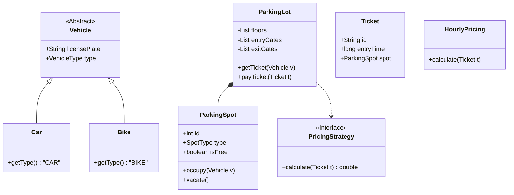

# LLD Interactive Practice: Design a Parking Lot 🚗

Welcome to the **most common** System Design interview question.
The "Parking Lot" problem tests your ability to take a vague requirement and turn it into working, maintainable Object-Oriented code.

## 1. The Requirement Gathering (The "Interview") 🗣️

**Interviewer**: "Design a system for a multi-story parking lot."
**You**: (Don't just start coding! Ask questions.)

*   **Q**: What types of vehicles? (Car, Bike, Truck?) -> *A: All three.*
*   **Q**: Different spot sizes? -> *A: Small, Medium, Large.*
*   **Q**: Pricing model? -> *A: Hourly. Bikes $10, Cars $20.*
*   **Q**: Multiple entry/exit points? -> *A: Yes.*
*   **Q**: Concurrency? -> *A: Yes, 100 cars might enter at once.*

---

## 2. The High-Level Flow (Use Case)

1.  User collects ticket at **Entry Gate** (System assigns a spot).
2.  User parks.
3.  User drives to **Exit Gate**.
4.  User pays ticket.
5.  Gate opens.

---

## 3. The Class Diagram (The Core) 🏗️

This is where we apply **SOLID Principles**.
*   **Single Responsibility**: A `Gate` shouldn't calculate `Price`. A `PricingStrategy` should.
*   **Open/Closed**: If we add "Electric Cars" later, we shouldn't modify the `ParkingLot` class.



---

## 4. The Database Schema (SQL) 💾

When the interview shifts to "How do we store this persistent data?"

```sql
-- 1. The Parking Facility
CREATE TABLE parking_lots (
    id SERIAL PRIMARY KEY,
    name VARCHAR(100),
    address TEXT
);

-- 2. The Physical Spots
CREATE TABLE parking_spots (
    id SERIAL PRIMARY KEY,
    lot_id INT REFERENCES parking_lots(id),
    floor_number INT,
    spot_number INT,
    spot_type VARCHAR(20), -- COMPACT, LARGE, MOTORBIKE
    is_occupied BOOLEAN DEFAULT FALSE
);

-- 3. The Transaction (Ticket)
CREATE TABLE tickets (
    id SERIAL PRIMARY KEY,
    entry_gate_id INT,
    vehicle_number VARCHAR(20),
    spot_id INT REFERENCES parking_spots(id),
    entry_time TIMESTAMP DEFAULT NOW(),
    exit_time TIMESTAMP,
    status VARCHAR(20) -- ACTIVE, PAID
);
```

---

## 5. Key Challenges & Solutions 🧠

### A. How to find a spot efficiently?
**Naive Approach**: Loop through all 10,000 spots to find a `FALSE` value. (Slow O(N)).
**Better Approach**: Maintain a **Min-Heap** or separate `List<AvailableSpots>` for every floor.
*   Get Spot: Pop from list (O(1)).
*   Free Spot: Push to list (O(1)).

### B. Concurrency (Two cars want Spot #50)
**Problem**: Car A and Car B both check DB, see Spot #50 is empty. Both book it. Collision!
**Solution**: Database Locking.
```sql
-- Pessimistic Lock (Prevents others from reading)
SELECT * FROM parking_spots WHERE id = 50 FOR UPDATE;
```
Or usually simpler:
```sql
UPDATE parking_spots SET is_occupied = TRUE, vehicle_id = 'ABC'
WHERE id = 50 AND is_occupied = FALSE;
-- If this returns 0 rows updated, it means someone else took it. Retry.
```

---

## 6. Summary for the Interview

1.  **Clarify** constraints first.
2.  **Classes**: Vehicle, Spot, Ticket, Gate.
3.  **Pattern**: Use **Strategy Pattern** for Pricing (allows changing logic easily).
4.  **Scaling**: Use meaningful Locking for concurrency.

